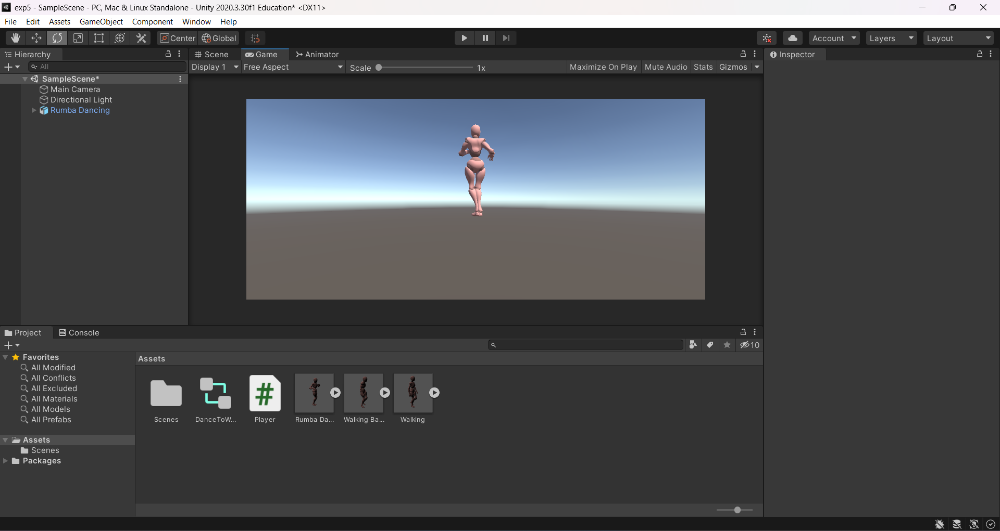

# Ex5-Animator-Movement
## Aim:
<p>To develop an animator movement for a player object using unity.

## Algorithm:
### Step 1:
Import necessary libraries for Unity and system collections.

### Step 2:
Define a class named "Player" inheriting from MonoBehaviour for Unity functionality.

### Step 3:
Declare public variables for animator, x, and y coordinates.

### Step 4:
Initialize the animator component in the Start method.

### Step 5:
Continuously update x and y based on input axes in the Update method.

### Step 6:
Set animator parameters "X" and "Y" based on input values.

### Step 7:
Ensure player GameObject has Animator component and proper input settings in Unity Editor.

## Program:
Developed By:SETHUKKARASI C<br>
Register Number:212223230201
```
using System.Collections;
using System.Collections.Generic;
using UnityEngine;

public class Player : MonoBehaviour
{
    public Animator animator;
    public float x;
    public float y;

    // Start is called before the first frame update
    void Start()
    {
        animator = this.gameObject.GetComponent<Animator>();
    }

    // Update is called once per frame
    void Update()
    {
        x = Input.GetAxis("Horizontal");
        y = Input.GetAxis("Vertical");
        animator.SetFloat("X", x);
        animator.SetFloat("Y", y);
    }
}
```
## Output:


## Result:
An animator movement for a player object is developed successfully using unity.